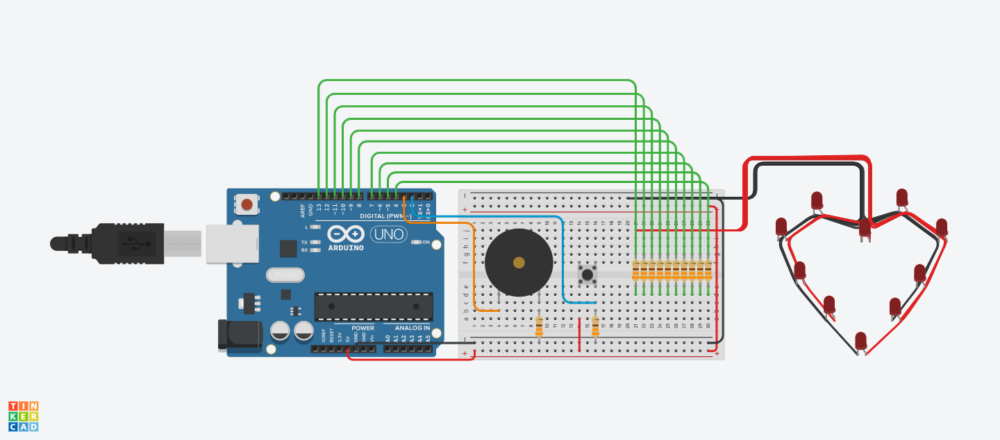

# Tarea con temática de San Valentin para curso de ARACT
Hecha por Daniel Hernández Muñoz - Grupo E

## Lista de materiales
- Arduino Arduino
- Zumbador
- Botón
- 10 leds rojos
- 12 resistencias de 330 Ω

## Construcción
- Clona el repositorio (o da clic en [Descargar ZIP](https://github.com/lordfriky/san_valentin/archive/main.zip)).
- Descomprime el archivo `san_valentin-main.zip`
- Renombra la carpeta `san_valentin-main` a `san_valentin` (si no se hace este paso el IDE de Arduino arrojará un error).
- Abre `san_valentin.ino` en el IDE de Arduino.
- Conecta tu Arduino UNO a tu computadora (elige tu placa en la pestaña de Herramientas --> Puerto si es necesario).
- Da clic en Subir.
- Desconecta el Arduino de tu computadora.
- Conecta tu botón al pin 2 como se indica en el diagrama (preferiablemente usa una resistencia de 330 Ω).
- Conecta el zumbador al pin 3 como se indica en el diagrama (preferiablemente usa una resistencia de 330 Ω).
- Conecta los leds de tu corazón del pin 4 al 13 (preferiablemente usa una resistencia de 330 Ω para cada led). Recuerda que están numerados en sentido a las manecillas del reloj.
- Da energía a tu Arduino y listo.

## Video
[Aquí](https://youtu.be/foxGqEqQvj4) puedes encontrar un video del funcionamiento de este proyecto.
